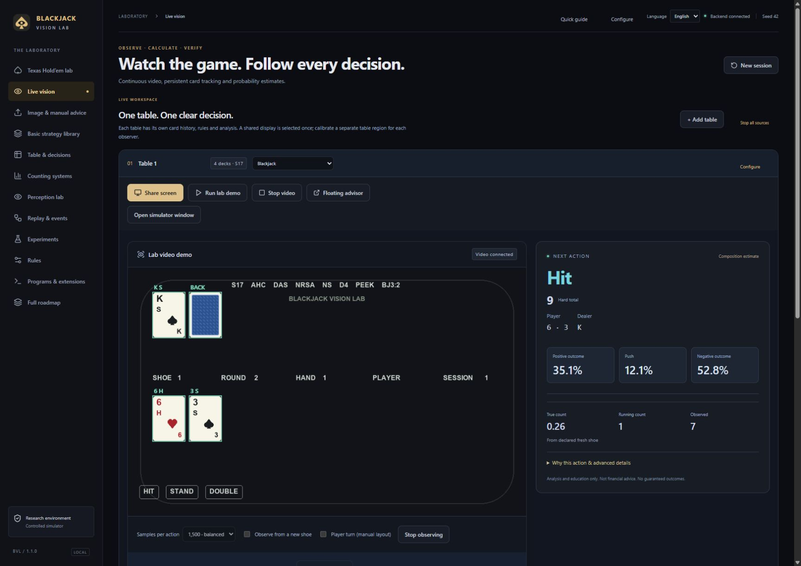

# Blackjack Vision Lab


A local, open-source blackjack simulation and visual analysis lab. Share a screen, follow exposed cards across hands, and read a clear action with basic strategy, expected value and modeled outcome probabilities.


**English by default. Italian is available in the language selector.** [Italian introduction](README.it.md) · [Windows releases](https://github.com/youtrustshop-dot/blackjack-vision-lab/releases) · [Quick guide](docs/QUICK_START.md)





## Start


The [Windows 1.1.0 release](https://github.com/youtrustshop-dot/blackjack-vision-lab/releases/tag/v1.1.0) provides an installer and portable ZIP. Windows x64 and Microsoft WebView2 are required. The packaged app includes its backend and offline OCR model; Python, Node, GPU and API keys are unnecessary for the core application.


For source installation, Python 3.12 and Node.js 22 are useful:


```powershell

git clone https://github.com/youtrustshop-dot/blackjack-vision-lab.git

cd blackjack-vision-lab

.\setup.ps1

.\run.ps1

```


Open the launcher's local address in Chrome / Edge. Keep the launcher or desktop app running. The source launcher normally uses `http://127.0.0.1:8765`; desktop builds choose an available local port.


## A short answer first


- **Configure** selects 1, 2, 4, 6 or 8 decks, standard / hit-stand-only / custom play, S17/H17, payout, peek/ENHC, surrender and split/double rules.

- **Run lab demo** plays a real canvas video stream. The independent observer receives pixels, not hidden cards or the future shoe.

- **Share screen** opens the browser's screen / window / tab picker. Video keeps playing while the lab samples it automatically. Classic green tables with printed corners, visible total badges and English/Italian action buttons are located automatically. Include the whole game window and its controls. Other layouts can use calibration or confirmed cards. Audio is not requested.

- A compact advisor appears for a shared source. **Pop out advisor** uses a separate always-on-top window where Chromium supports Document Picture-in-Picture. Advanced details stay collapsed.

- Up to **five independent tables** retain separate histories, rules and counts. One selected display can supply multiple calibrated regions. Texas Hold’em has a calibrated visual-input and equity lab; other sources remain monitors.

- **Paste, drop or upload an image**, or confirm cards manually. Optional observed-card lists and split context are explicit inputs. One image cannot reconstruct earlier cards.


Version 1.0.1 added an external recognition profile: the previous detector

read only lab artwork. A local PaddleOCR/ONNX Runtime adapter now reads printed

ranks and visible turn/control text. It verifies the player total before giving

guidance. The reported 7 + 2 versus 6 screenshot produces **Double** without

manual card entry. See [external recognition evidence](docs/EXTERNAL_VISION.md).


A valid player hand always has an immediate legal basic-policy recommendation. A normal 20 stands; A+7 is displayed as soft 18, with A=11 and alternative total 8. A separated composition estimate can refine the action; overlapping EV intervals retain basic strategy. Unreadable or expired video asks for confirmation / fresh evidence.


## Strategy and counts


The offline library includes hard totals, soft totals, pairs, naturals and **550 unordered two-card rank/dealer combinations**. Tens, J, Q and K share value 10. These are rule-generated independent-draw calculations. Finite deck composition and count deviations are compared separately.


Exposed-card events update Hi-Lo running count and true count. A "shoe" is the collection of cards dealt from the chosen decks. Counts cover a complete history only when the necessary exposures were observed from a known reset; otherwise their scope is the observed portion. Repeated video observations do not count cards twice.


Win/push/loss and EV are distinct. Sampled outcomes describe net profit of the active hand and new splits, excluding existing other hands. Sampling intervals do not measure vision accuracy. Current-action EV does not establish a next-round betting edge.


## Essential and optional programs


| Program | Role |

|---|---|

| Windows x64 + WebView2 | Packaged desktop app |

| Chrome / Edge | Continuous sharing and supported floating window |

| Python 3.12 + Node 22 | Source installation only |

| Rust / Windows tools / PyInstaller | Creating the Windows distribution |

| [Clef CUDA runtime](docs/CLEF.md) | Optional independent local image verification |

| [Chrome / Edge helper](extensions/chromium/README.md) | Optional user-clicked tab image / local analysis |

| ONNX detector / other models | Research adapters needing validated weights |


Clef is isolated from the fast mathematical core. Laya remains deferred; Jev credentials are unnecessary. The included detector is validated for **lab card artwork**. Arbitrary game graphics and camera cards need separate validation. Texas Hold’em equity is available; optimal poker betting policy is separate work. The extension is source, not a published store package.


## Verification and documentation


[Measured status](docs/STATUS.md) · [Roadmap](ROADMAP.md) · [Requirements/evidence](docs/REQUIREMENTS.json) · [Live video](docs/LIVE_VISION.md) · [API](docs/API.md) · [Windows build](docs/DESKTOP.md) · [Design](docs/DESIGN.md) · [Changelog](CHANGELOG.md)


```powershell

.venv/Scripts/python.exe -m pytest -q

npm --prefix ui test

npm --prefix ui run build

```


Tests cover settlement, finite-shoe references, legal advice, all starting combinations, aces, real video decoding, visible resets, five isolated observers, input limits and source ownership. Browser review includes lab video, image recognition and translation. Personal display-picker selection and unpacked extension installation are manual browser checks. No universal recognition, 30-FPS-analysis or sub-100-ms guarantee is made.


`engine.py` defines rules/settlement; `solver.py` computes finite-shoe EV; `strategy.py` generates the basic reference; `simulator.py` owns the seeded shoe. `advice.py` supplies immediate policy, `live.py` reconstructs observations and samples outcomes, and `advisor_api.py` handles image/manual inputs. The React/TypeScript UI and Tauri shell process locally. [External photographic failures](docs/EXTERNAL_BENCHMARKS.md) and [reference attribution](THIRD_PARTY_REFERENCES.md) remain inspectable.


## License


Original code is [MIT](LICENSE). Dependencies, fonts and Microsoft components retain their own licenses, included with Windows packages. Clef retains upstream Apache-2.0 terms. See [contributions](CONTRIBUTING.md) and [publication provenance](docs/PUBLICATION.md). Historical research archives retain their original measurements and language.


**Analysis and education only. Not financial advice. No system guarantees a winning outcome. This tool supports inspecting decisions under stated rules, evidence and mathematical assumptions.**


## Reliability and Hold’em — 1.1.0

[Complete-session architecture and provider scope](docs/RELIABILITY.md) · [Texas Hold’em](docs/POKER.md)
