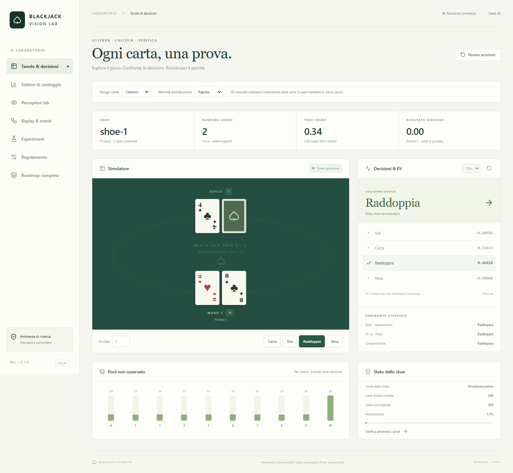

# Blackjack Vision Lab

Laboratorio locale per simulazione Blackjack, ricostruzione visuale delle carte, conteggio, analisi degli EV e replay. Include un motore indipendente, una pipeline visuale e prove di correttezza riproducibili.

## Avvio

Scaricare l'installer o la versione portabile dalla [release Windows 0.1.0](https://github.com/youtrustshop-dot/blackjack-vision-lab/releases/tag/v0.1.0).

Per avviare dai sorgenti:

~~~powershell
git clone https://github.com/youtrustshop-dot/blackjack-vision-lab.git
cd blackjack-vision-lab
.\setup.ps1
.\run.ps1
~~~

Su Windows, l'installer scaricabile dalla release avvia il laboratorio con backend incluso, senza Python o Node. La distribuzione portabile richiede insieme `Blackjack Vision Lab.exe`, `bjlab-backend.exe`, `WebView2Loader.dll` e `licenses/`; l'archivio della release conserva questi file. WebView2 deve essere disponibile sul computer.

Richiede Python 3.12+ e Node.js 22+. In PowerShell dalla directory del progetto eseguire `./setup.ps1`, poi `./run.ps1`. Aprire http://127.0.0.1:8765.

Questi requisiti riguardano l'avvio dai sorgenti. `requirements-lock.txt` fissa l'ambiente verificato e contiene anche strumenti di ricerca/build opzionali: lo setup usa le versioni come constraint, senza installare tutti i pacchetti di ricerca.

Sviluppo frontend: `npm --prefix ui run dev`. Verifica: `python -m pytest` nell'ambiente installato e `npm --prefix ui run build`.

La versione corrente dei sorgenti/browser include il pulsante **Riconnetti** e
**Perception lab → Apri strumenti → Condividi finestra o schermo**. Aprire la
pagina locale in Chrome o Edge per scegliere la sorgente. La condivisione usa
un’anteprima locale e l’import esplicito di un fotogramma; la grafica di carte
esterne resta da validare. [Istruzioni e verifiche](docs/SCREEN_SHARING.md).
Queste aggiunte non sono presenti nei binari della release v0.1.0.

## Principi

- Il solver riceve solo informazioni osservabili; verità completa e ordine futuro sono riservati alla valutazione.
- Distribuzione, track visuale e classificazione hanno identità separate.
- Pool non osservato e inventario fisico pescabile sono concetti separati.
- Ogni EV dichiara metodo, precisione, regole e normalizzazione; i timeout non sono risultati esatti.
- Confronti a pari regole e informazione, intervalli per Monte Carlo e tolleranze documentate.
- Nessun modello linguistico decide le azioni. Jev/Laya sono esperimenti separati.

## Documentazione

- [Roadmap integrata](ROADMAP.md): tutte le fasi e criteri di accettazione.
- [Requisiti](docs/REQUIREMENTS.json): inventario completo e prove.
- [Stato verificato](docs/STATUS.md): misure effettive e lavoro rimanente.
- [API](docs/API.md): simulatore, analisi, replay e benchmark.
- [Vision](docs/VISION.md): rendering, capture, identità e incertezza.
- [Riferimenti e licenze](THIRD_PARTY_REFERENCES.md).
- [Distribuzione Windows](docs/DESKTOP.md).
- [Esperimenti di percezione](docs/PERCEPTION_EXPERIMENTS.md) e [fotografie esterne](docs/EXTERNAL_BENCHMARKS.md).

La presenza di un adapter non prova che un benchmark esterno sia stato eseguito. Consultare la roadmap per lo stato verificato.

## Comandi del laboratorio

Analisi di uno stato osservato:
~~~powershell
python -m bjlab.cli analyze stato.json
~~~

Strategia replacement e analisi finite con continuazione composition-dependent:
~~~powershell
python -m bjlab.cli strategy --model replacement --cell hard 16 10 --output risultato.json
python -m bjlab.cli strategy --model finite --cell hard 16 10 --output risultato.json
~~~

Dataset, benchmark separati di detection/calibrazione/tracking e confronto policies:
~~~powershell
python -m bjlab.cli dataset datasets/synthetic_cards --sessions 120 --seed 13
python validation/tools/vision_benchmark.py datasets/synthetic_cards
python validation/tools/policy_benchmark.py --rounds 100000 --seconds 120
~~~

I report distinguono il lavoro richiesto da quello completato entro il budget.
La dashboard include correzioni motivate, import di immagini/video, quattro angoli, sistemi di conteggio e intervalli dei confronti.

Gli import indipendenti mantengono mazzi sconosciuti; per associare un'immagine alla sessione bisogna selezionarlo negli strumenti. Il video è una clip di un singolo round, con timeline dei frame campionati e stato fino al frame scelto. Il modello visuale supporta le carte del laboratorio; i risultati negativi sulle fotografie esterne restano documentati. Laya è rinviato dall'utente e non serve per avviare il sistema.

## Architettura

`bjlab/engine.py` definisce regole e settlement; `solver.py` EV; `simulator.py` shoe e sessioni; `counting.py` sistemi di conteggio; `events.py` stato ricostruibile; `vision.py` e `datasets.py` percezione; `api.py` laboratorio locale; `ui/` interfaccia React/TypeScript. `validation/` e `experiments/` sono separati dal runtime.

L'ambito è simulatore controllato, immagini e sessioni registrate. Non include interazione con casinò o account esterni.

## Licenza e contributi

Il codice originale del progetto è distribuito con [licenza MIT](LICENSE).
Le dipendenze, i font e gli eventuali componenti Microsoft mantengono le proprie
licenze, conservate in `ui/src-tauri/licenses/` e nei pacchetti Windows.
I riferimenti di ricerca sono descritti in [THIRD_PARTY_REFERENCES.md](THIRD_PARTY_REFERENCES.md).
Vedere [CONTRIBUTING.md](CONTRIBUTING.md) per le verifiche richieste alle modifiche.

I report conservano le misure della distribuzione Windows verificata. I dataset
generati più grandi possono essere rigenerati; le conversazioni originali usate
per definire i requisiti non sono incluse nel repository pubblico.
Vedere [la nota di pubblicazione](docs/PUBLICATION.md).
