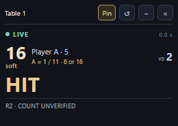

# External advisor: unreleased Windows candidate

This is a separate change above the vision benchmark branch. The installed and
published desktop **1.1.1** remains frozen. The candidate retains the package's
base version, displays **research candidate** in its native title and records its
code commit, dirty flag and source hashes in the frozen build provenance.
It is not a replacement release, a new poker strategy or a universal detector.

## Compact follow-up

The current source reuses that same window and authoritative backend. The default
content area is **260 x 220 logical pixels**, with a **230 x 180** minimum. It shows
the essential player/dealer evidence, one large action, LIVE / UNCERTAIN / STALE,
and a short independent count status. Full EV explanations and inventory remain
in the main application. Unknown evidence is not a retained recommendation.

Open advisor prefers the native window when its host is available. Hide, minimize,
reopen, reset position and always-on-top control this same view, without starting
another observer or capture loop. Always-on-top defaults on for a first window;
an explicit saved choice is respected. Reset recovers the compact geometry into
the available monitor work area. Logical dimensions persist across DPI changes;
negative monitor origins are supported by the geometry code. These unit checks
do not establish a physical multi-monitor result.

The running installed backend was inspected on **2026-10-04** at `:28445`:
health reported 1.1.1, and `/api/native/advisor/status` returned **404**. That process
was the published `release/v1.1.1/bjlab-backend.exe`. It cannot display the new
research window. A candidate uses its own loopback URL; opening an old browser
tab does not connect its captures to a different backend.

Compact preparation is independent of reader selection. No new cloud reader or
uncertified count has been promoted into live advice by this UI change.

The earlier vision-learning follow-up was source-only. The compact follow-up now
has its own portable build and actual native control smoke, recorded in
[ADVISOR-002 verification](../validation/results/compact-advisor/verification.json).
It does not exercise a personal display picker. The earlier Windows/Chrome bridge
evidence remains attributed to PR #3. The detector is still
`calibrated-corners-2-presence`; a package label `1.1.1` alone does not identify a
binary. Check the candidate title, commit, dirty flag, source hashes and backend URL.



This preview uses a mocked current snapshot to test the UI, not a new vision
accuracy measurement. The native smoke separately created the real 260 x 220
window, checked default pinning and a saved unpinned choice, minimize/reset,
three close/reopen cycles with the same observer, stale suppression and clean
process exit. It ran on one monitor at scale 1.0. Main minimization used own images
submitted over HTTP; it is not proof of continuing physical screen capture.

The portable build is based on `4845c34` with a recorded dirty working tree while
independent documentation/corpus work was in progress. The embedded source hashes
were checked by both executable smokes. Installed release manifest hashes still
match. No installer was created or installed by this follow-up.

## Usage and ownership

In the Windows candidate, **Pop out advisor** opens a second Tauri/WebView window
for the selected active observer. The native title bar can be dragged outside
the main application and between monitors. The window is resizable and has an
optional **Always on top** checkbox. The close button and native X hide only this
view; they do not stop capture, delete the observer or restore an internal panel.
Reopening reuses the same native window. Multiple observed tables can be selected
in the advisor without starting another capture or solver.

Position and size are stored locally. Geometry is fitted into available monitors
on reopening, including monitors with negative desktop coordinates. Closing the
main application exits the advisor and shuts down the owned backend. A stopped
source, a disconnected backend or expired evidence cannot retain actionable advice.

The standalone browser still uses Document Picture-in-Picture where supported;
availability, title-bar controls and minimization behavior depend on the browser.
An internal fallback is labelled as such. Neither a browser tab nor an ordinary
browser window is advertised as a guaranteed native always-on-top window.

## One authoritative state across browser and native contexts

```text
Capture page (native WebView or Chrome at this candidate's local URL)
    -> existing live observer and solver in the local backend
    -> source-bound snapshot -> native advisor view
                              -> existing main-page view
```

Screen sharing in Chrome must use the **same local backend URL** as the native
candidate. A separately running server such as the old `:8767` instance has its
own observers and cannot control this candidate's native window. The browser and
native view exchange state through the local HTTP bridge, not shared React memory.
The advisor itself has no capture loop or solver. Window commands travel through
the inherited sidecar pipe; acknowledgements report native properties. No remote
Tauri IPC permission, arbitrary URL, executable launch or website automation is
exposed by this bridge. Writes require the local custom header and same-origin
checks. Delayed controls from a previous table are rejected.

Snapshots carry source ID, table/state identity and the original capture timestamp.
Motion epochs immediately invalidate earlier evidence, including late frame results.
Evidence expires after 2.2 seconds measured from capture; polling or redrawing does
not renew it. Enabled Clef verification must agree with the current state. The
integrity gate and incomplete-count restrictions remain in effect. Stale cards can
be displayed as last evidence, while action and probability estimates are withheld.
Native capture protection is requested for the advisor; detection of feedback in
every browser/OS capture combination is not certified.

## Verification and reproducibility

The unit checks cover source expiry, late frames, verifier disagreement/current-state
binding, obsolete native acknowledgements, foreign origins, table switching and
geometry recovery with a removed monitor or negative coordinates. The native smoke
uses the **actual executable and second native window**, with hidden test windows,
and submits owned simulator images through HTTP. It does not select a personal
display or treat simulated pixels as recordings from an external provider.

```powershell
.venv/Scripts/python.exe -m pytest -q tests/test_native_advisor.py
cd ui
npm test
npm run build
cd ..
./scripts/build-desktop.ps1 -PortableOnly -ReleaseDirectory artifacts/compact-advisor/native-candidate
.venv/Scripts/python.exe -X utf8 scripts/smoke-desktop.py --release artifacts/compact-advisor/native-candidate --work artifacts/compact-advisor/native-smoke-work --native --advisor --evidence artifacts/compact-advisor/native-smoke.json
.venv/Scripts/python.exe -X utf8 scripts/smoke-desktop.py --release artifacts/compact-advisor/native-candidate --work artifacts/compact-advisor/backend-smoke-work --evidence artifacts/compact-advisor/backend-smoke.json
```

The build script uses the previously configured Python/GNU Rust/Tauri build tools;
they are build dependencies, not dependencies users must install to run the frozen
Windows executable. WebView2 is required by the native host.

Manual acceptance remains necessary for physical dragging across monitors, mixed
DPI, actual display sharing while the main application is minimized, and capture
feedback when the selected screen contains the advisor or main preview. Mathematical
geometry tests and HTTP submissions while minimized do not prove these cases.
Complete-session vision/count reconstruction and capture-to-display latency also
remain outside this window smoke. See [the vision matrix](VISION_BENCHMARK_MATRIX.md)
for the measured detector results and unexecuted alternatives.
