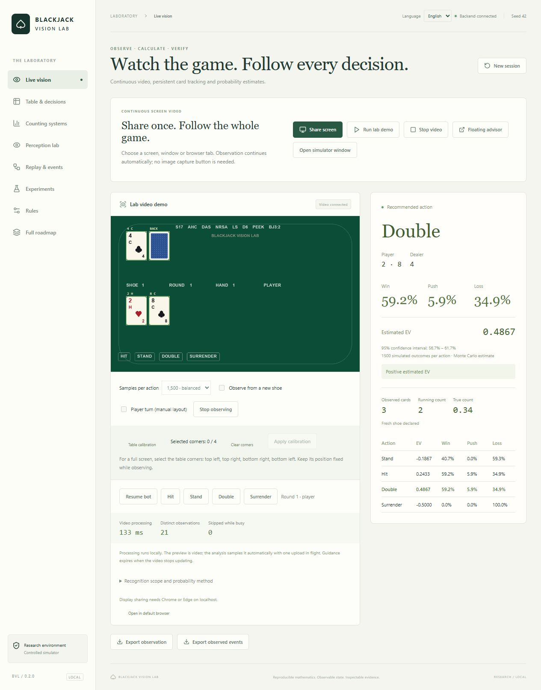
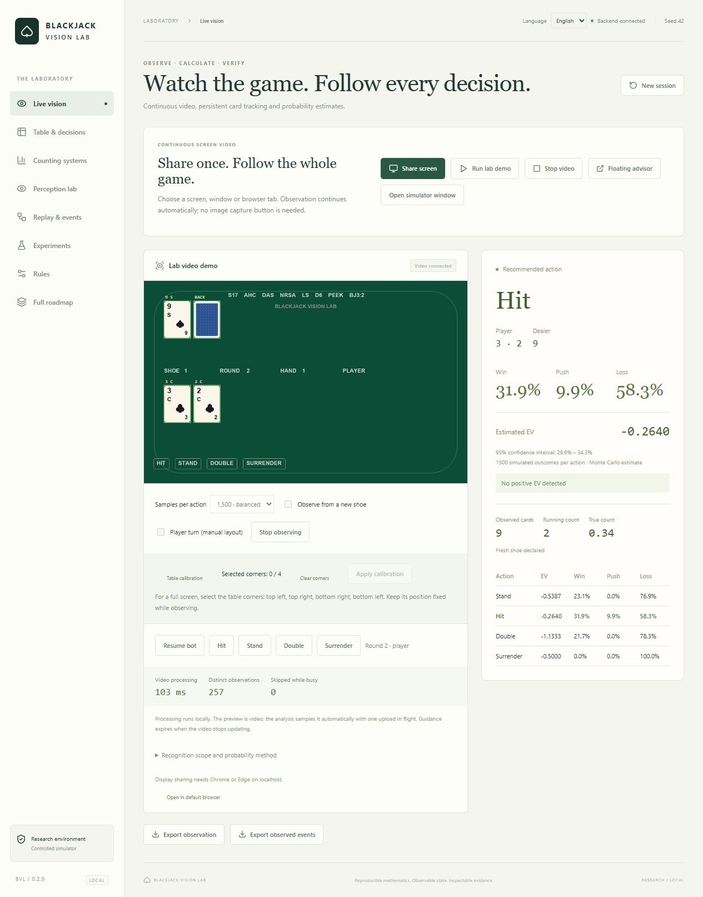
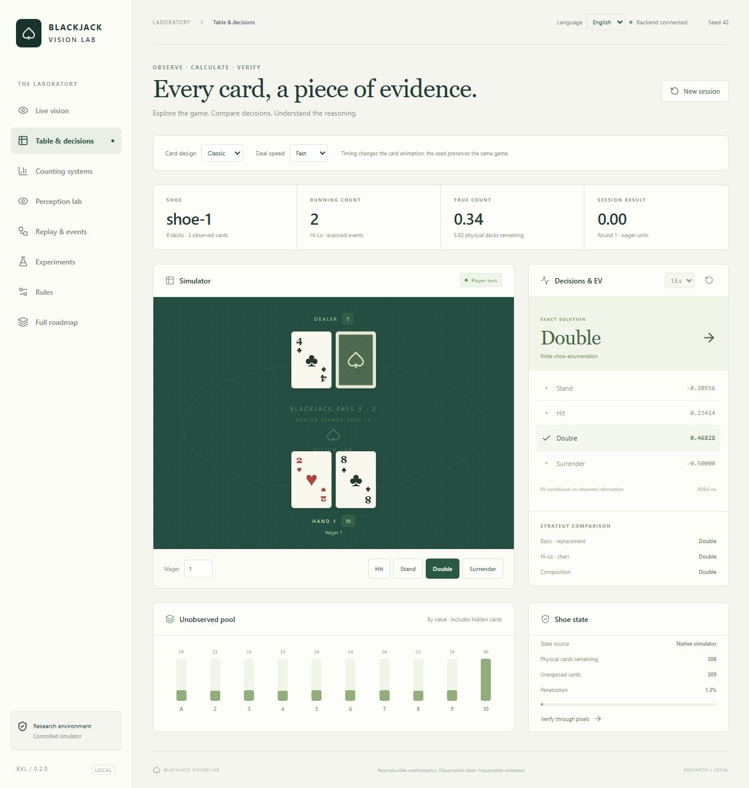
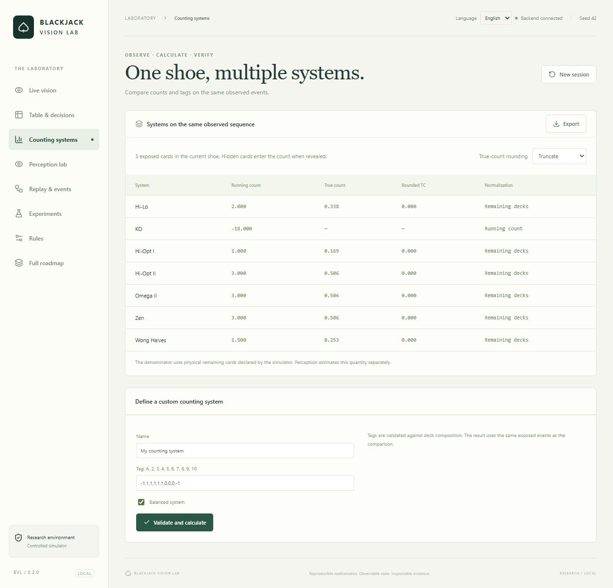
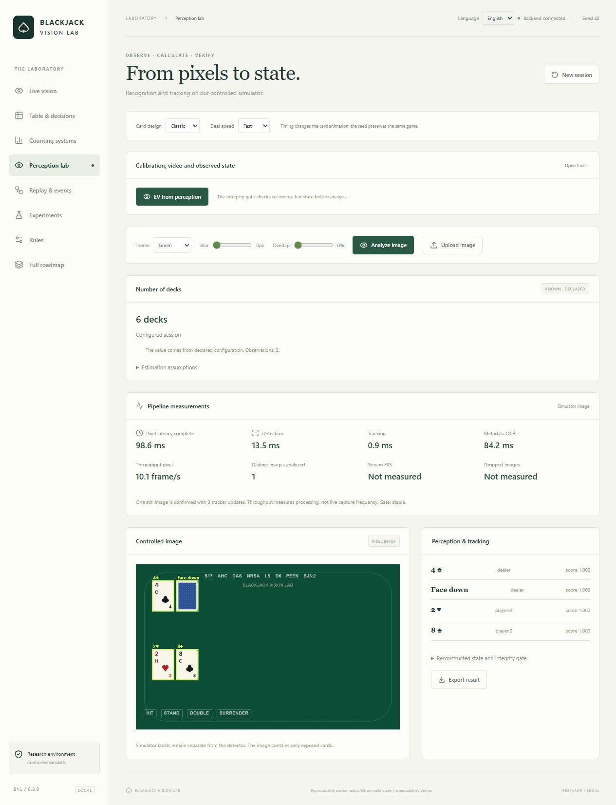
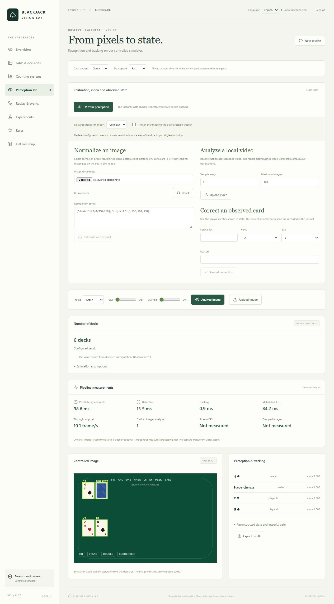
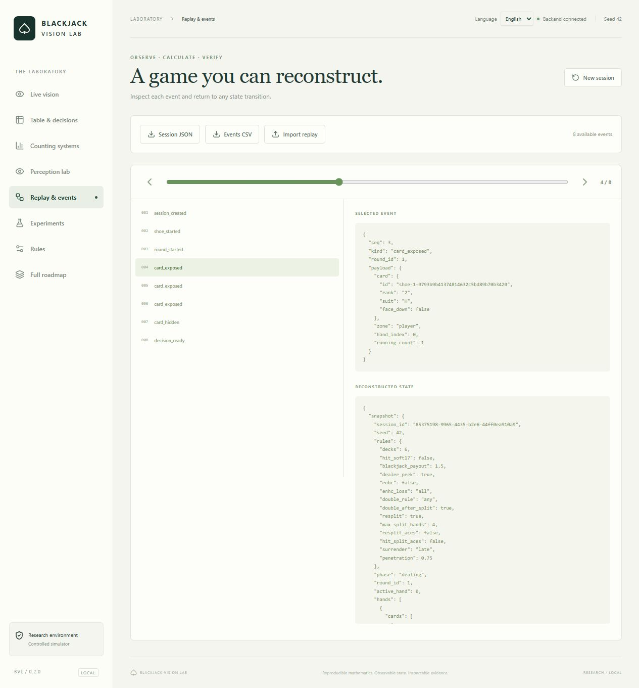
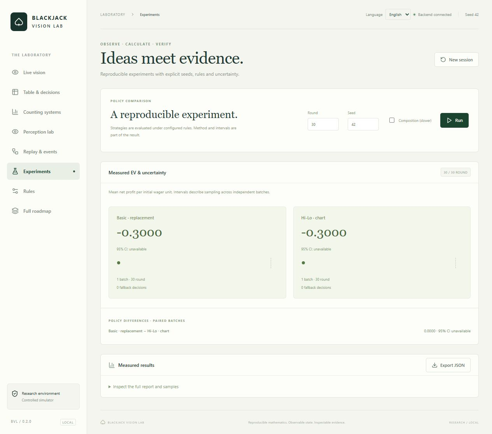
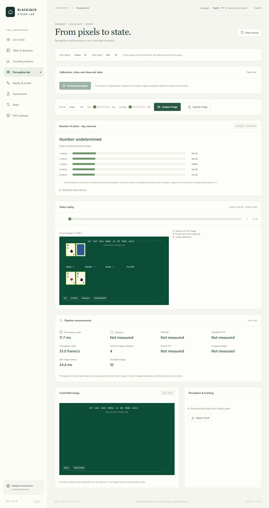

# English interface gallery — 0.2.0

These are actual browser captures with English selected. No probabilities, actions or counts were added to the images.

The historical v0.1 screenshots remain available in the original release/tag history; the current primary gallery uses English. Historical verification reports retain their original filenames and measurements. See [the current browser receipt](../BROWSER_LIVE_VERIFICATION.json).
