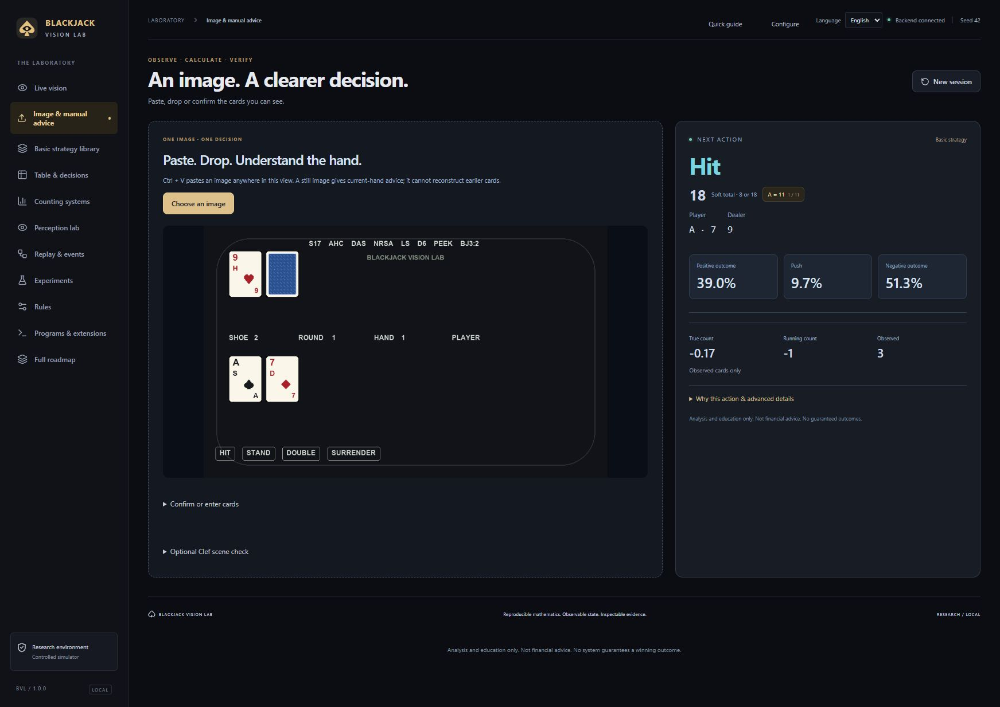
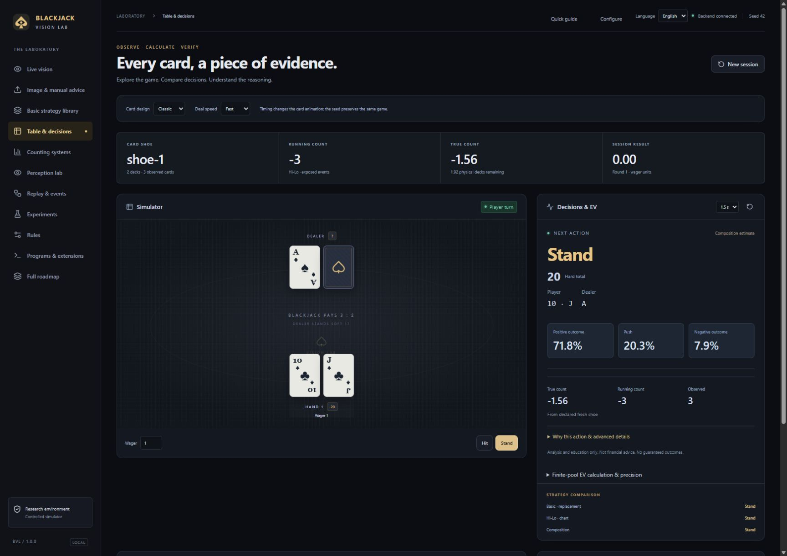
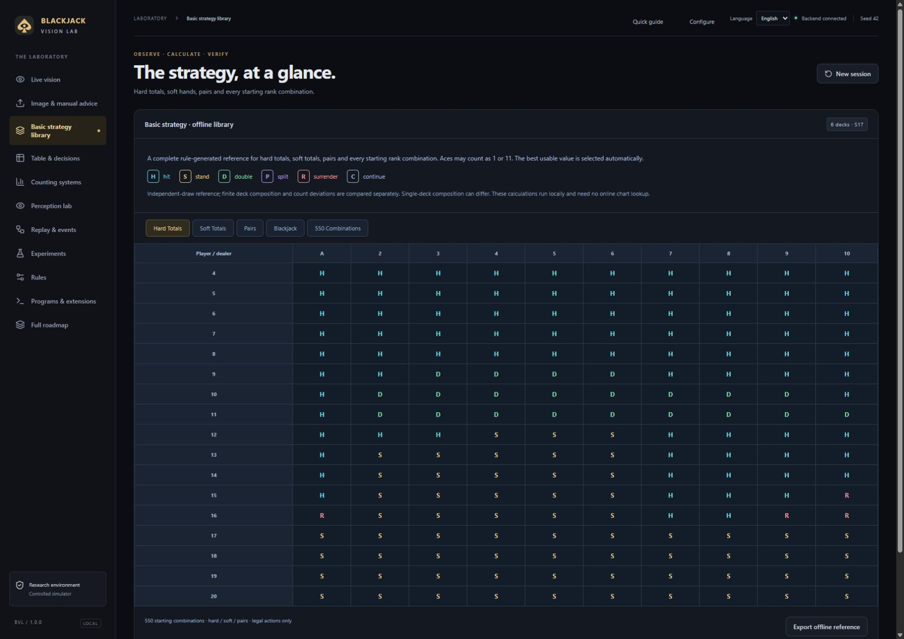
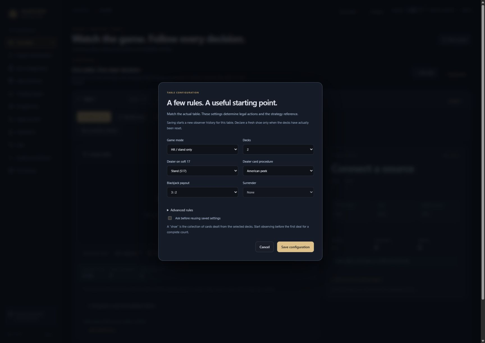
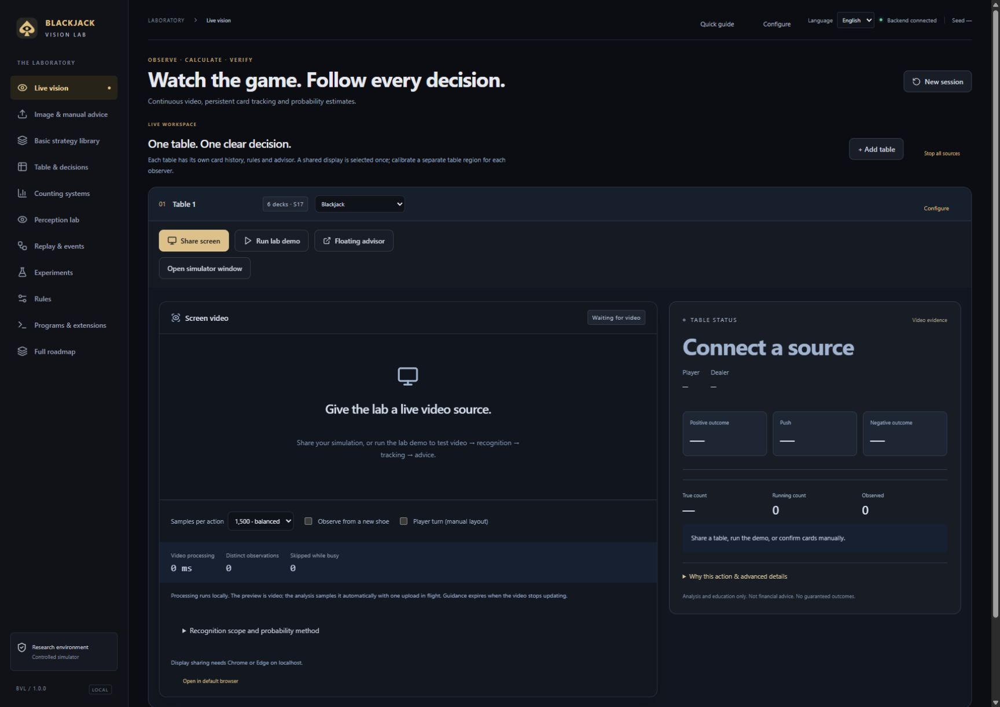
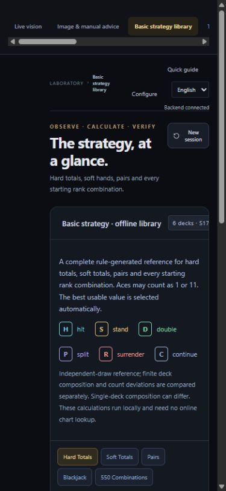

# English interface gallery — 1.0.0

Actual browser captures with English selected. No actions, counts or probabilities were added to the images.

The five-table run is recorded in [the current browser evidence](../BROWSER_V1_VERIFICATION.json), including observed scheduling delays and stale statuses. Recognition is scoped to lab artwork.

Other captures in this folder originate from 0.2.0. Historical verification reports keep their own versions; earlier imagery is available unchanged in the v0.2.0 Git tag.
